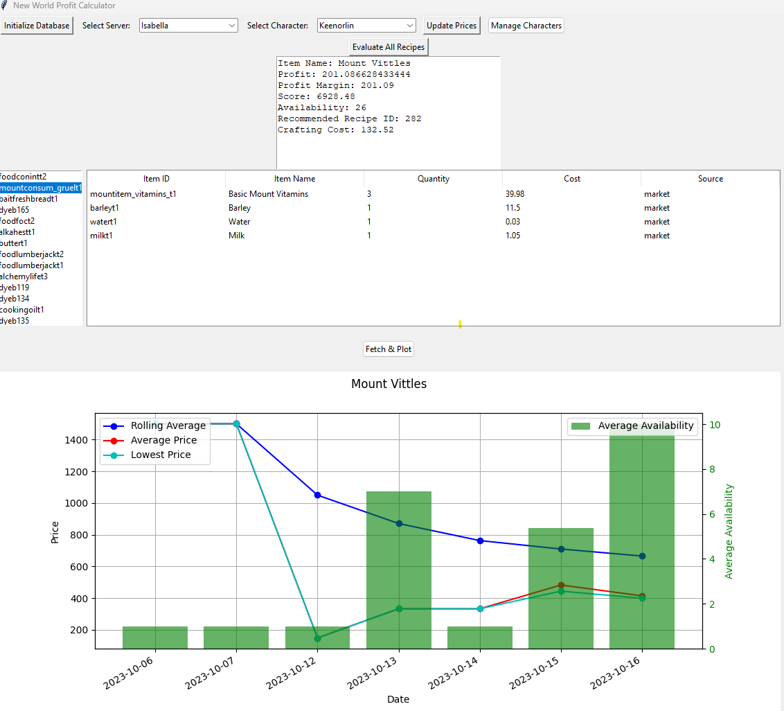

# New-World-Profit-Calculator



## Overview
The New-World-Profit-Calculator is a dedicated tool for the New World game that enhances player experience. It serves as a comprehensive data manager for in-game item prices, player profiles, and crafting recipes. In addition, it offers insightful analyses on the data, ensuring players make well-informed decisions in-game.

## Features
- **Data Parsing**: Seamlessly processes item prices from current market data.
- **Transaction Logging**: Maintains a detailed log of item transactions.
- **Player Management**: Allows adding, updating, and retrieving player profiles along with their trade skills.
- **Recipe Handling**: Enables efficient management of in-game crafting recipes and the respective skill requirements.
- **Data Analysis**:
  - **Price Trends Analysis**: Investigates price fluctuations over a period, granting insights into the market's behavior.
  - **Profitability Analysis**: Evaluates the financial benefits of crafting items in comparison to direct buy/sell.
  - **Recommendation System**: Furnishes buy/sell advice derived from prior analyses, offering players actionable recommendations.

## Setup

### For Windows/Powershell:
1. Ensure you have Python 3.x installed (Version 3.11 recommended).
2. Install `virtualenv` using pip:
    ```powershell
    pip install virtualenv
    ```
3. Create a virtual environment, activate it, and install the required packages:
    ```powershell
    python -m venv venv
    .\venv\Scripts\activate.ps1
    pip install -r requirements.txt
    ```
4. Optionally, customize the server details in database/data/servers.json using the ID from NW Market Prices. When selecting a server on the site, note the ID in the URL - that's the numeric ID required for your server definition. Servers 'Isabella' and 'Leo' are pre-configured for your convenience. Further, you can set up your character and skills based on the example in database/data/players.json. However, the application does offer an interface for this task.
5. Run the main script:
    ```
    python main.py
    ```
6. Click 'Initialize Database' in the application. This process may be time-consuming and may render the UI unresponsive temporarily.
7. After database initialization, select your server and ensure your characters' skills are correctly configured.
8. Click 'Update Prices'. The latest prices from [NW Market Prices](https://nwmarketprices.com/) will be fetched. For up-to-date prices, consider becoming a scanner on their site and execute a scan before employing this tool.
9. Once prices are refreshed and the UI becomes responsive, click 'Evaluate All Items'. The list will be populated with the top 50 items, ranked by the score function located in analysis/crafting_profit.py:calculate_score(), currently based on the formula: profit x availability.
10. Select an item_id from the left panel to view the associated graphical data and item specifics.

